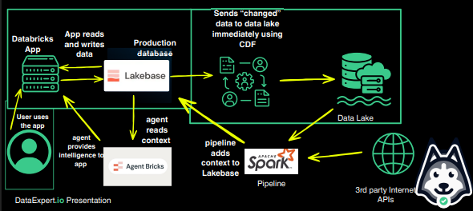
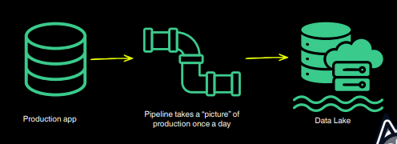
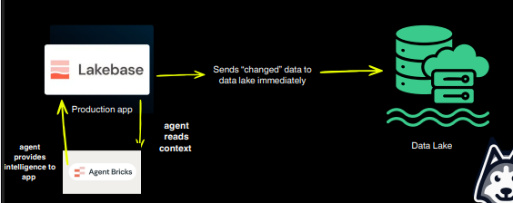

# Day 1: Setting Up Lakebase and App

## What was built on day 1

## What is the difference between a database and a data lake?

- **Database**: customers use, optimized for small lookups, latency is crucial
- **Data lake**: analysts and AI use, optimized for entire dataset crunching, speed is less important

## What is Lakebase and why is it powerful?

**Lakebase** is a fully managed Postgres database integrated into the Databricks platform. Build real-time transactional applications alongside your lakehouse data, with automatic scaling, instant branching, and native Unity Catalog integration
- **Build low-latency apps**: Connect Databricks Apps or any application to Lakebase for transactional workloads
- **Serve lakehouse data**: Sync Unity Catalog tables into Lakebase so applications can query them at low latency
- **Store Postgres changes**: Store Postgres changes as Delta tables for downstream pipelines and audit
- **AI and ML**: Use Lakebase as an online feature store for ML models, or as a state store for agents

## What is change data capture and how do we use CDF?

### The old way

The problems with this way are
- What if the data changes more often than once a day?
- How does the production latency change when we query?
- How can we make sure we captured all the data

### The new world (with CDC)

Why is this better?
- No data pipeline
- Handles intraday changes
- No spiky pressure on production
- Unstructured data context with Vectors

## How can we make a Databricks App work with Lakebase?

See [Databricks AI Bootcampt Day 1 Homework](https://github.com/ppkhai2612/databricks-ai-bootcampt-day-1-homework)
