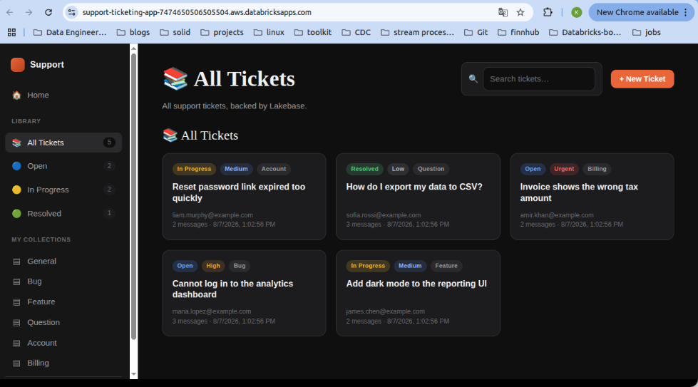
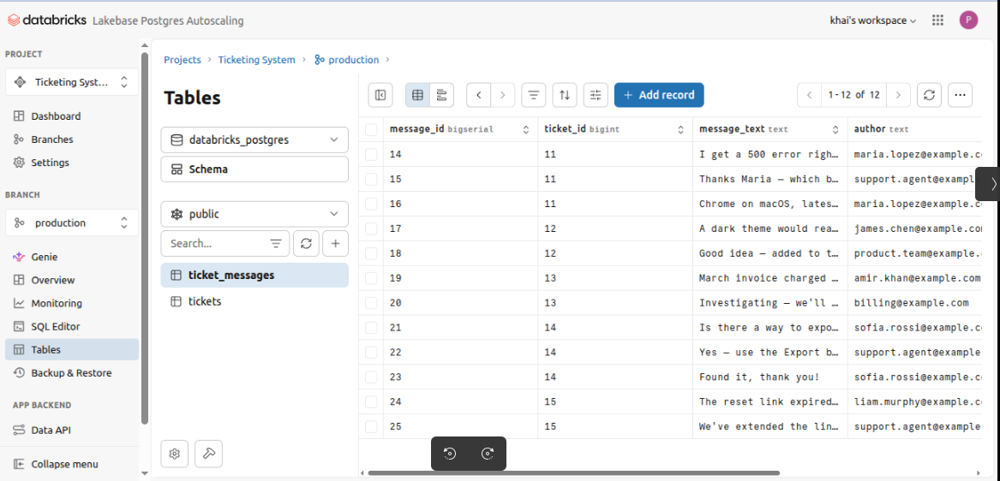

# Lakebase Support Ticket App (FastAPI)

An internal support-ticket system built as a **Databricks App** backed by **Lakebase**
(Databricks-managed Postgres). Users can browse tickets, read and add messages, create tickets,
change status, and delete tickets — all persisted in Lakebase. The UI is a single-page app styled
after the macOS **Books** app (dark theme, sidebar collections, card grid).

Day 1 boot-camp homework. Backend is **FastAPI** (not Flask).

---

## Features

**Core requirements**
- View all tickets, filtered/searchable, as a card grid
- Open a ticket to read its message thread
- Create a new ticket
- Add a message to a ticket
- Update a ticket's status
- Reads and writes go to Lakebase (no hard-coded data)

**Bonus challenges — all implemented**
- ✅ Ticket **priority** (low/medium/high/urgent) and **category** (bug/feature/question/…)
- ✅ **Filter by status** (and by category / free-text search) via the sidebar + search box
- ✅ **Input validation + helpful errors** (Pydantic models, JSON error responses, inline UI messages)
- ✅ **Ticket statistics** dashboard (`/api/stats` → tiles on Home)
- ✅ **Delete with confirmation** (browser confirm dialog → `DELETE` endpoint, messages cascade)
- ✅ **Improved visual design** (Books-style dark theme, badges, modal detail view)

---

## Architecture

| File | Role |
|---|---|
| `app.py` | FastAPI app: routes, Pydantic validation, identity, JSON error handling |
| `db.py` | Schema creation + all ticket/message SQL (uses `lakebase`) |
| `lakebase.py` | psycopg2 connection to Lakebase via the Databricks secret scope |
| `notebook.py` | Self-contained Databricks notebook: schema + sample data + verify |
| `setup_secrets.py` | Stores the Lakebase URL as a Databricks secret (run once) |
| `templates/index.html` | Single-page frontend (vanilla JS + CSS, no build step) |
| `app.yaml` | Databricks Apps run command + env (secret scope/key names only) |
| `requirements.txt` | Python dependencies installed when deploying the app |

**Auth to Lakebase:** a static Postgres connection URL is stored in the Databricks secret
`database/lakebase-url` and read at runtime (base64-decoded). No credentials are committed.

**End-user identity:** Databricks Apps inject the logged-in user as the `X-Forwarded-Email` header;
that value becomes `created_by` / message `author`. Locally it falls back to the SDK user.

### Schema

```sql
CREATE TABLE tickets (
    ticket_id   BIGSERIAL PRIMARY KEY,
    title       TEXT NOT NULL,
    status      TEXT NOT NULL DEFAULT 'open'  CHECK (status IN ('open','in_progress','resolved')),
    priority    TEXT NOT NULL DEFAULT 'medium' CHECK (priority IN ('low','medium','high','urgent')),
    category    TEXT NOT NULL DEFAULT 'general',
    created_by  TEXT NOT NULL,
    created_at  TIMESTAMPTZ NOT NULL DEFAULT now()
);

CREATE TABLE ticket_messages (
    message_id   BIGSERIAL PRIMARY KEY,
    ticket_id    BIGINT NOT NULL REFERENCES tickets(ticket_id) ON DELETE CASCADE,
    message_text TEXT NOT NULL,
    author       TEXT NOT NULL,
    created_at   TIMESTAMPTZ NOT NULL DEFAULT now()
);
```

`ticket_messages.ticket_id` references `tickets(ticket_id)`; deleting a ticket cascades to its messages.

---

## Setup & deployment

### 1. Provision Lakebase
1. In Databricks: **Catalog → Lakebase → Create instance**; wait until it's **Available**.
2. Open the instance → **Roles & Databases** → **enable native / password authentication** and
   create a role with a **password** (Lakebase defaults to short-lived OAuth tokens; we need a
   static password for a long-lived connection URL).
3. Copy the connection URL:
   ```
   postgresql://<role>:<password>@<host>.database.cloud.databricks.com:5432/databricks_postgres?sslmode=require
   ```

### 2. Store the secret (once)
With the Databricks CLI/SDK authenticated (or from a notebook terminal):
```bash
python setup_secrets.py     # paste the connection URL when prompted
```
This creates scope `database`, key `lakebase-url`, and grants `users` READ.

### 3. Create schema + sample data
Import **`notebook.py`** into the workspace and **Run All** — a self-contained notebook that
connects with psycopg2 (same pattern as `lakebase.py`), creates the schema, inserts 5 tickets with
2–3 messages each, and displays a verification table. Reads the Lakebase URL from the
`database/lakebase-url` secret, or paste it into the notebook's widget.

> Seeding is destructive/idempotent: it deletes existing tickets first, then re-inserts the sample
> set. Don't run it after adding real tickets you want to keep.
>
> (The app also creates the tables on its own at startup via `db.ensure_schema()`; this notebook is
> what adds the sample rows.)

### 4. Run locally (optional)
```bash
python app.py               # → http://localhost:8000
# or: uvicorn app:app --reload
```
For local runs you can skip the secret scope by exporting the URL directly:
```bash
export LAKEBASE_URL='postgresql://<role>:<password>@<host>...:5432/databricks_postgres?sslmode=require'
```

### 5. Deploy on Databricks Apps
1. **Workspace → Create → Git folder**, paste this repo's URL, clone it.
2. **Compute → Apps → Create app → Custom**.
3. Point the app source at the cloned Git folder (must contain `app.py` + `app.yaml`).
   Databricks reads `app.yaml` automatically (`uvicorn app:app --host 0.0.0.0 --port 8000`).
4. Click **Deploy**. Grant the app's service principal READ on the `database` secret scope if prompted.
5. To update later: pull the Git folder, click **Deploy** again.

### 6. Verify (test checklist)
- [ ] Existing tickets load from Lakebase
- [ ] Create a new ticket → it appears
- [ ] Add a message to a ticket → it appears in the thread
- [ ] Change a ticket's status → badge updates
- [ ] Refresh the app → all changes persist
- [ ] Delete a ticket (with confirmation) → it's gone and messages are cascaded

---

## Inspecting the tables (for the screenshot submission)

From a Databricks SQL editor connected to `databricks_postgres`, or `psql`:
```sql
SELECT ticket_id, title, status, priority, category, created_by, created_at FROM tickets ORDER BY ticket_id;
SELECT message_id, ticket_id, author, left(message_text, 40) AS message, created_at
FROM ticket_messages ORDER BY ticket_id, message_id;
```

---

## API reference

| Method | Path | Purpose |
|---|---|---|
| GET | `/healthz` | Liveness probe |
| GET | `/` | Single-page UI |
| GET | `/api/me` | Current user's email |
| GET | `/api/stats` | Totals + counts by status/priority |
| GET | `/api/tickets?status=&priority=&category=&q=` | List tickets (filtered) |
| GET | `/api/tickets/{id}` | Ticket + its messages |
| GET | `/api/tickets/{id}/messages` | Messages for a ticket |
| POST | `/api/tickets` | Create a ticket `{title, priority, category}` |
| POST | `/api/tickets/{id}/messages` | Add a message `{message_text}` |
| PATCH | `/api/tickets/{id}/status` | Update status `{status}` |
| DELETE | `/api/tickets/{id}` | Delete a ticket (cascades messages) |

---

## Reflection

**What was the most difficult part?** Getting authentication to Lakebase right — Lakebase defaults
to short-lived OAuth tokens, so the app instead relies on a native-password role whose connection
URL is stored as a Databricks secret and read at runtime, keeping credentials out of the code.

**How is Lakebase different from a traditional analytics table?** Lakebase is an OLTP Postgres
database built for low-latency, row-level reads and writes with real transactions, primary/foreign
keys, and constraints — ideal for operational app state. A traditional analytics (Delta/lakehouse)
table is columnar and optimized for large scans and batch analytics, not the frequent small
single-row inserts and updates this ticket app performs.

**What feature would you add next?** Full-text search across message bodies plus assignee/ownership
and email notifications when a ticket's status changes — and Lakebase Change Data Feed to stream
ticket events into the lakehouse for analytics.

---

## Security note

No passwords, connection strings, or API keys are committed. `.env` is gitignored; the deployed app
reads the Lakebase URL from the Databricks secret scope declared in `app.yaml`.

## Screenshots

### App



### Lakebase

