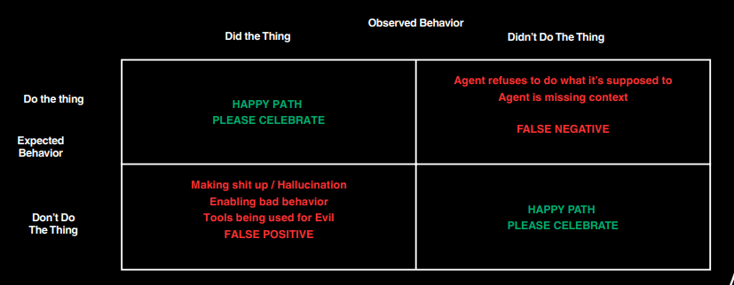

# Day 2: Context Engineering

## What are common failure modes for Agents?

**Prevent False Positives**
- Middlewares: Think of this like Band-Aids to catch egregious
things
- Multi-agent Architecture: An agent can only falsely posit if you allow it to
- Correct Context: The better the context, the lower the probability

**Prevent False Negatives**
- Tracing is your best friend when it comes to false negatives!
- Watching your customers actually use your agents is another one!

## How do we get the right context for our AI agents?

Context comes from
- System prompt
- Tools
    - RAG retrieval
        - Keyword matching
        - Vector matching
    - Other API integrations (GitHub, Slack, Linear,...)

## What are the types of Agents?

## When should you use a multi-agent architecture?