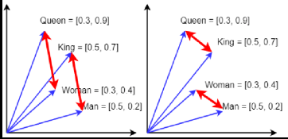
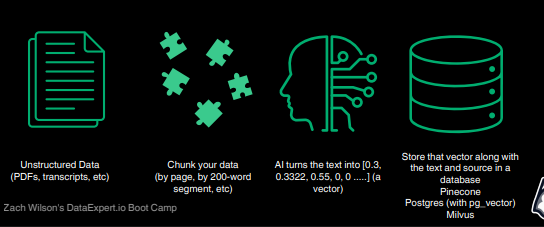
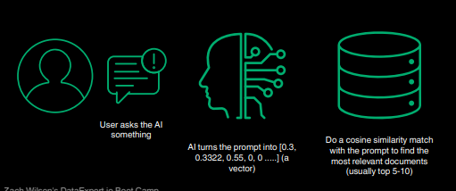

# Day 2: Context Engineering

## What are common failure modes for Agents?

**Prevent False Positives**
- Middlewares: Think of this like Band-Aids to catch egregious
things
- Multi-agent Architecture: An agent can only falsely posit if you allow it to
- Correct Context: The better the context, the lower the probability

**Prevent False Negatives**
- Tracing is your best friend when it comes to false negatives!
- Watching your customers actually use your agents is another one!

## How do we get the right context for our AI agents?

Context comes from
- System prompt
- Tools
    - RAG retrieval
        - Keyword matching
        - Vector matching
    - Other API integrations (GitHub, Slack, Linear,...)

### The System prompt does four things

- Role: what the agent is
- Objective: what success means
- Constraints: what is must NOT do
- Decision heuristics: how it chooses actions

### How to optimize your system prompt?

You can be systematic about it using a framework like `dspy` or `AdalFlow` to auto-optimize it based on a set of evaluations

### RAG - Retrieval Augmented Generation

Retrieval can be:
- Entity-based (think `WHERE user_id = 7`)
- Keyword-based (think `'keyword' IN text_string`)
- Vector-based (cosine similarity of vectors is the most common)

### Vector Matching

Vectors find the closest "meaning" based on an input text in a multi dimensional space

### How many dimensions should I use?

The more dimensions you do a vector match on:
- The slower it is
- The more space it takes up
- The more accurate it is

OpenAI has two options:
- 1536 dimensions is the "small" model
- 3072 dimensions is the "big" model

### How do we vectorize something?

### How do we retrieve these vectors?

## What are the types of Agents?

- Single Step (stateless): Your homework grading is like this
- React Agents: Respond to the output of tools and Reason
- Fully autonomous loops: Keep going until a specific condition is met or they've looped too much
- Multi-agent architecture: One agent uses another agent as a tool
- Deep Research: Goes deep into trends similar to fully autonomous with a clearer stopping condition

## When should you use a multi-agent architecture?

If your agent is doing too many things, it's time
- Tool bloat (most common reason)
- Context bloat (as context windows expand, agents perform worse)
- Efficiency (using cheaper models and agents for simpler tasks is smart)